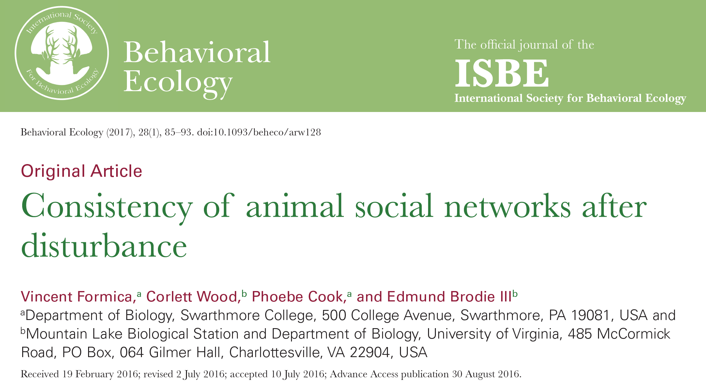
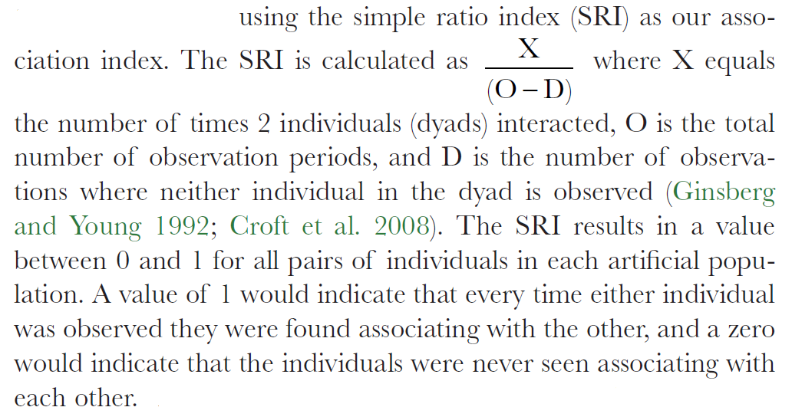
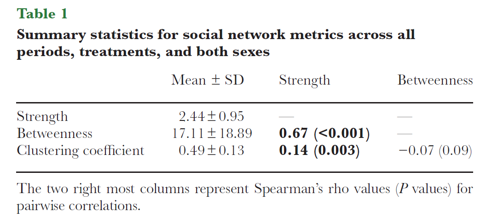
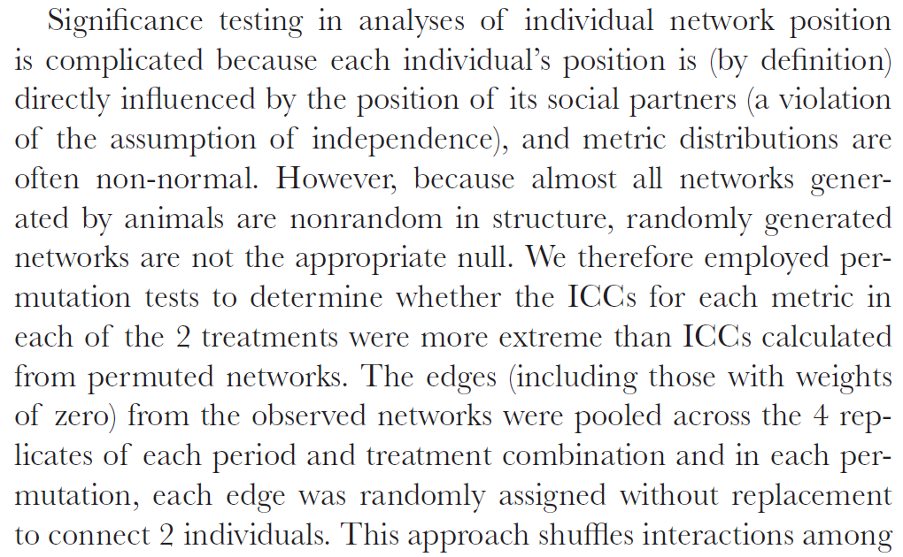
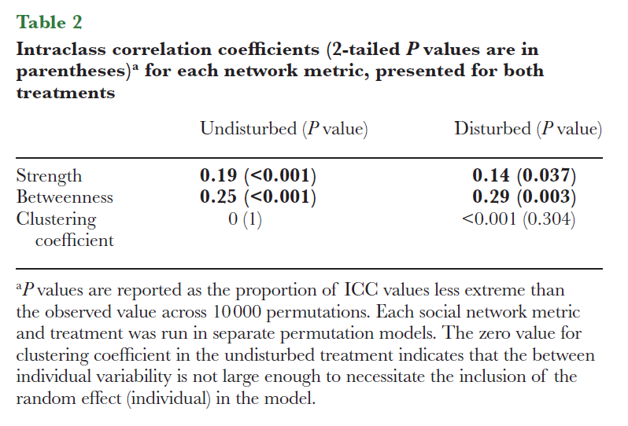
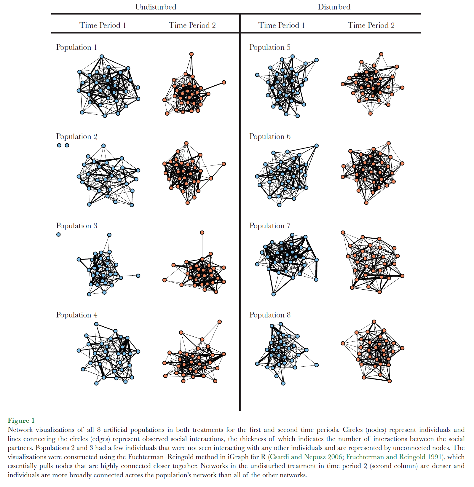
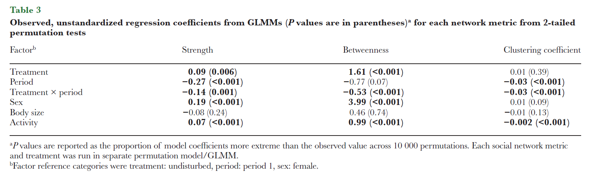

```{r setup, include=FALSE}
knitr::opts_chunk$set(echo = TRUE)
```

#Load in Packages

```{r, message = FALSE}
library(tidyverse)
library(lme4)
library(lmerTest) #gives pvals in lmer summary
library(igraph)
library(tnet)
library(lsmeans)
```

#Introduction



Paper aims:

This paper aims to assess how repeatable social network metrics are, at the level of the individual and at the level of the group. They do this using social networks of artifical lab colonies of forked fungus beetles. To investigate whether there has been a significant change in network metrics, they compare network metrics for 2 successive time periods. Additionally, to investigate whether disturbance influences the stability of these network metrics, they compare stability of undisturbed colonies to those that have been disturbed and transplanted into new enclosures. Their rationale for this research question is that many studies claim that network position has effects on fitness, and for this to be evolutionarily meaningful there must be some degree of repeatability in network positions for individuals and groups.


Details of experiment:

- Sample sizes: 
4 colonies in the undisturbed treatment, and 4 in the disturbed treatment, each with 15 male and 15 female beetles.

- Experiment: 
Observe colonies for 12 days, disturb the treatment colonies by catching individuals and isolating them from groupmates for 4 days, then reunite groupmates in a new enclosure. Undisturbed colonies were left unmolested in their initial enclosures. Colonies were then observed for another 12 days.   

- Social Networks:
Networks were undirected and edges were based on the frequency of social interactions, gauged by proximity. This was turned into an association score; the Simple Ratio Index



- Network measures of interest:
Repeatability in the following network measures is analysed in the paper
Strength: The weighted equivalent of binary degree is the sum of all edge weights connected to the node (Farine).

Betweenness: A count of the number of shortest paths that flow through the node. This measures how important a node is for connecting disparate parts of a social network.

Clustering Coefficient: A measure of cliquishness, quantified as the proportion of and frequency with which an individual’s social partners interact with each other (Croft et al. 2008).

- Types of analyses performed:
An intraclass correlation (in the form of a mixed model) was used to determine how repeatable individual network measures were, and a linear mixed model was used to determine the repeatability of group-level network metrics. Due to data points in social network analysis not being independent, all determinations of significance were done via permutation tests.  


Findings:


#Load, describe and wrangle Data

```{r}
netPos=read.csv("NetworkPositions_Observed.csv", header = T)
edges=read.csv("SRI_edgelist.csv", header = T)
netPos$Period=as.factor(as.character(netPos$Period))
netPos$Treatment=as.factor(netPos$Treatment)
```
```{r}
head(edges)
```

edges DF Description:

Focal.Letter/Social.Partner: Individual IDS of focal individual and partner
Treatment.Period: successive observation periods 1 and 2
Group.ID.Populations: Colony ID
Treatment: Control (undisturbed), or Treatment (disturbed)
num_interactions/scans.where.at.least.1.seen: used to calculate SRI.
SRI: the measure of the strength of the dyads relationship

```{r}
head(netPos)
```

netPos DF Description:

Focal.Letter.ID: ID of focal individual
TubPeriod: Tub/time period for values
Strength/betweenness/Clustering.coefficient: network metrics calculated
Period: successive observation periods 1 and 2
Treatment: C (undisturbed), or T (disturbed)
Sex: M or F
Tub: Colony ID
Elytra: Size of the insects elytra, used as a proxy for body size
Number.of.observations: Number of times they were seen on top of fungus, proxy for activity levels


Check for missing values:
```{r}
nrow(edges)-nrow(edges[complete.cases(edges), ])
nrow(netPos)-nrow(netPos[complete.cases(netPos), ])

#very few missing values! Sweet!
```

#Analysis

#Data Summary analysis:

Get means/sds for network measures, and test for the correlation between different network measures:

Get correlation coefficients for variables of interest:
```{r}
sb=cor.test(netPos[complete.cases(netPos), ][,4], netPos[complete.cases(netPos), ][,5], method = "spearman")
sc=cor.test(netPos[complete.cases(netPos), ][,4], netPos[complete.cases(netPos), ][,6], method = "spearman")
bc=cor.test(netPos[complete.cases(netPos), ][,5], netPos[complete.cases(netPos), ][,6], method = "spearman")
```

get means/sds for network measures, and test for the correlation between different network measures:
```{r}
summary <- netPos %>% 
  summarise(mean_strength = mean(strength, na.rm = TRUE),
            sd_strength=sd(strength, na.rm = TRUE),
            mean_betweenness = mean(betweenness, na.rm = TRUE),
            sd_betweenness=sd(betweenness, na.rm = TRUE),
            mean_cluster = mean(Clustering.coefficient, na.rm = TRUE),
            sd_cluster =sd(Clustering.coefficient, na.rm = TRUE)) %>% round(digits =2)


df=data.frame(metrics=c("strength", "betweenness", "clustering coef"))
df$mean_SD=c(paste(summary$mean_strength, " +/- ", summary$sd_strength), paste(summary$mean_betweenness, " +/- ", cdata$sd_betweenness), paste(summary$mean_cluster, " +/- ", summary$sd_cluster))
df$Strength=c(paste("--"), paste(round(sb$estimate, 2), "(", round(sb$p.value, 3), ")"), paste(round(sc$estimate, 2), "(", round(sc$p.value, 3), ")"))
df$Betweenness=c(paste("--"), paste("--"), paste(round(bc$estimate, 2), "(", round(bc$p.value, 3), ")"))
print(df)
```


I get essentially the same values as do the original authors!


#See if Intra-class correlation coefficient (ICC) for individual network measures is significant in the UNDISTURBED networks:

An ICC will tell you whether an individual at the 2 timepoints significantly resembles themself.

A not on these permutation tests: When modelling social networks, permutation tests are used as the non-independence of data points violates assumptions of parametric statistics. Rather than permuting networks in a way that maintains the structure of the data (as is the norm with social network analysis), and then calculating network metrics from these permuted networks, the authors simply shuffled network metrics among individuals. Additionally, they shuffle these values between populations, rather than permuting within populations; this I think is also an error as the structure of each network will be changed when doing this. I think these may be issues with their analysis, but I have opted to follow their methods as closely as I can. When permuting, I pooled data in the same way they did (see screenshot below); permutations were pooled across all replicates for each separate treatment. This is why I separate the dataframe into 2 dataframes; one for the undisturbed treatment, one for the disturbed.



The paper said that they included individual ID nested within Tub as random effects. However, as this is an intraclass correlation, each individual is represented only once, meaning the number of levels of the individual random effect is the same as the number of data points, which doesnt make sense and is not allowed by lmer. Thus I have not included the individual as a random effect.

```{r}
#Get separate dataframes for the undisturbed and disturbed treatments
und=filter(netPos, Treatment=="C")
dis=filter(netPos, Treatment=="T")
```
```{r}
#Get data into separate dataframes for each network measure

und_strength=spread(und[,c(1,4,7,10)], Period, strength) #Get only columns of interest and  spread so that values for periods are side by side
und_betweenness=spread(und[,c(1,5,7,10)], Period, betweenness)
und_clust=spread(und[,c(1,6,7,10)], Period, Clustering.coefficient)

dis_strength=spread(dis[,c(1,4,7,10)], Period, strength)
dis_betweenness=spread(dis[,c(1,5,7,10)], Period, betweenness)
dis_clust=spread(dis[,c(1,6,7,10)], Period, Clustering.coefficient)

colnames(und_strength)[3:4] <- c("P1", "P2") #rename columns so they are more easily accessible
colnames(und_betweenness)[3:4] <- c("P1", "P2")
colnames(und_clust)[3:4] <- c("P1", "P2")
colnames(dis_strength)[3:4] <- c("P1", "P2")
colnames(dis_betweenness)[3:4] <- c("P1", "P2")
colnames(dis_clust)[3:4] <- c("P1", "P2")
```

```{r, message = FALSE}
#This function just performs intra-class correlation analysis. I have to run 6 analyses, so figured a function would be neater. 

ICC_perms=function(df, n_perms){
  obs=summary(lmer(P1 ~ P2 + (1|Tub) , data = df[complete.cases(df), ]))$coefficients[2, 1] #gets coef for real data
  perms=numeric(n_perms)
  temp=df[complete.cases(df), ] #gets rid of NAs
  
  for (i in 1:n_perms){
    temp$P1=sample(temp$P1, length(temp$P1), replace = FALSE) #permutes and calculates coefs for shuffled data
    perms[i]=summary(lmer(P1 ~ P2 + (1|Tub) , data = temp))$coefficients[2, 1]
    if (i %% 100==0){
      print(i) #just a counter, since it takes a LONG time to run!
    }
  }
  return(list(obs, perms, n_perms)) #Spits out list with observed coef, permuted coefs, and number of perms
  }
```

```{r, message = FALSE}
#the model within the ICC_perms() function I made throws a warning about a singular fit with the model as specified. This probably means that the random effect of Tub is not necessary, at least for some permuted data configurations. The authors did not mention how they dealt with this, so I have opted to ignore it. Message = FALSE stops R showing all these warnings.

global_perms=1000 #all perm tests are with 10,000 perms

ICC_und_strength=ICC_perms(und_strength, global_perms) #Calculates ICC with above function

hist(ICC_und_strength[[2]], breaks=50, xlim=c(-1, 1)) #Uses numbers in list returned by function to plot and calculate p values
abline(v=ICC_und_strength[[1]], col='red')
pval_s_u=sum(ICC_und_strength[[2]] > ICC_und_strength[[1]])/(ICC_und_strength[[3]])
pval_s_u
```
```{r, message = FALSE}
ICC_und_betweenness=ICC_perms(und_betweenness, global_perms)

hist(ICC_und_betweenness[[2]], breaks=50, xlim=c(-1, 1))
abline(v=ICC_und_betweenness[[1]], col='red')
pval_b_u=sum(ICC_und_betweenness[[2]] > ICC_und_betweenness[[1]])/(ICC_und_betweenness[[3]])
pval_b_u
```
```{r, message = FALSE}
ICC_und_clust=ICC_perms(und_clust, global_perms)

hist(ICC_und_clust[[2]], breaks=50, xlim=c(-1, 1))
abline(v=ICC_und_clust[[1]], col='red')
pval_c_u=sum(ICC_und_clust[[2]] > ICC_und_clust[[1]])/(ICC_und_clust[[3]])
pval_c_u
```


#See if ICC for individual network measures is significant in the DISTURBED networks:

```{r, message = FALSE}
ICC_dis_strength=ICC_perms(dis_strength, global_perms)

hist(ICC_dis_strength[[2]], breaks=50, xlim=c(-1, 1))
abline(v=ICC_dis_strength[[1]], col='red')
pval_s_d=sum(ICC_dis_strength[[2]] > ICC_dis_strength[[1]])/(ICC_dis_strength[[3]])
pval_s_d
```
```{r, message = FALSE}
ICC_dis_betweenness=ICC_perms(dis_betweenness, global_perms)

hist(ICC_dis_betweenness[[2]], breaks=50, xlim=c(-1, 1))
abline(v=ICC_dis_betweenness[[1]], col='red')
pval_b_d=sum(ICC_dis_betweenness[[2]] > ICC_dis_betweenness[[1]])/(ICC_dis_betweenness[[3]])
pval_b_d
```
```{r, message = FALSE}
ICC_dis_clust=ICC_perms(dis_clust, global_perms)

hist(ICC_dis_clust[[2]], breaks=50, xlim=c(-1, 1))
abline(v=ICC_dis_clust[[1]], col='red')
pval_c_d=sum(ICC_dis_clust[[2]] > ICC_dis_clust[[1]])/(ICC_dis_clust[[3]])
pval_c_d
```

Results dataframe:
```{r}
df2=data.frame(metrics=c("strength", "betweenness", "cluctering coef"))
df2$Undisturbed=c(paste(round(ICC_und_strength[[1]], 2), "(", round(pval_s_u, 3), ")"), paste(round(ICC_und_betweenness[[1]], 2), "(", round(pval_b_u, 3), ")"), paste(round(ICC_und_clust[[1]], 2), "(", round(pval_c_u, 3)))
df2$Disturbed=c(paste(round(ICC_dis_strength[[1]], 2), "(", round(pval_s_d, 3), ")"), paste(round(ICC_dis_betweenness[[1]], 2), "(", round(pval_b_d, 3), ")"), paste(round(ICC_dis_clust[[1]], 2), "(", round(pval_c_d, 3)))

print(df2)
```



My numbers are a little off from theirs, but are fairly close, and our analyses agree in terms of which values are significant, and the signs of the correlations!


#Visualize Undisturbed Networks at both time points:

```{r}
#This function turns the SRI (association) scores in the dataframe into an association matrix. I needed to do this for plotting the networks. I didn't generalize the function as I am only using it for tehse dpecific datasets.

df_to_matrix=function(df){ 

  names=unique(df$Focal.Letter) #extracts a list of individuals names from the column labels
  num_rows=length(names) #gets number of rows, as this is the number of nights recorded for individuals in this group
  n=1 #This counter just prevents duplicates being calculated (e.g. BA with Akim, and Akim with BA)

  #Set up or matrix:
  mat <- matrix(data=NA,nrow=num_rows, ncol=num_rows)
  diag(mat)=0
  colnames(mat) <- names
  rownames(mat) <- names
  
  #loop through names list and populate matrix:
  for (i in n:num_rows){
    for (j in (n+1):num_rows){ #counter +1 so that we don't get self-pairings (e.g. BA with BA)
      if ((n+1) <= num_rows){ #prevents this value from overshooting the actual length of the name list by 1
        if (nrow(filter(df, (Focal.Letter == names[i]) & (Social.Partner == names[j]))) != 0){ #dyads w/ SRI 0 don't appear
          SRI = filter(df, (Focal.Letter == names[i]) & (Social.Partner == names[j]))$SRI
        } else {
          SRI=0 #if row doesn't appear, means that dyad had an SRI of 0
          }
        mat[i,j]=SRI #fills in matrix index for that dyad
      }
    }
      n=n+1 #increase counter to cycle through every individual
  }
  mat[lower.tri(mat)] = t(mat)[lower.tri(mat)] #the above loop only populates top half of matrix, this makes lower half a mirror image as the edges are not directed
  return(mat)
}
```

```{r}
#Turn association matrices before and after disturbances into graph objects. I used Igraph for this as I am more familiar with it, the original paper used tnet. 

C1_1_graph=filter(edges, (Group.ID.Populations=="C1") & (Treatment.Period == 1)) %>% 
  df_to_matrix() %>% #uses function described above to get matrix
  graph.adjacency(mode="undirected", weighted=T) 
E(C1_1_graph)$width <- (E(C1_1_graph)$weight)*50 #just an arbitrary number to make weights visibly differentiable
V(C1_1_graph)$color <- "lightblue"

C1_2_graph=filter(edges, (Group.ID.Populations=="C1") & (Treatment.Period == 2)) %>% 
  df_to_matrix() %>% 
  graph.adjacency(mode="undirected", weighted=T) 
E(C1_2_graph)$width <- (E(C1_2_graph)$weight)*50 

C2_1_graph=filter(edges, (Group.ID.Populations=="C2") & (Treatment.Period == 1)) %>% 
  df_to_matrix() %>% 
  graph.adjacency(mode="undirected", weighted=T) 
E(C2_1_graph)$width <- (E(C2_1_graph)$weight)*50 
V(C2_1_graph)$color <- "lightblue"

C2_2_graph=filter(edges, (Group.ID.Populations=="C2") & (Treatment.Period == 2)) %>% 
  df_to_matrix() %>% 
  graph.adjacency(mode="undirected", weighted=T) 
E(C2_2_graph)$width <- (E(C2_2_graph)$weight)*50 

C3_1_graph=filter(edges, (Group.ID.Populations=="C3") & (Treatment.Period == 1)) %>% 
  df_to_matrix() %>% 
  graph.adjacency(mode="undirected", weighted=T) 
E(C3_1_graph)$width <- (E(C3_1_graph)$weight)*50 
V(C3_1_graph)$color <- "lightblue"

C3_2_graph=filter(edges, (Group.ID.Populations=="C3") & (Treatment.Period == 2)) %>% 
  df_to_matrix() %>% 
  graph.adjacency(mode="undirected", weighted=T) 
E(C3_2_graph)$width <- (E(C3_2_graph)$weight)*50 

C4_1_graph=filter(edges, (Group.ID.Populations=="C4") & (Treatment.Period == 1)) %>% 
  df_to_matrix() %>% 
  graph.adjacency(mode="undirected", weighted=T) 
E(C4_1_graph)$width <- (E(C4_1_graph)$weight)*50 
V(C4_1_graph)$color <- "lightblue"

C4_2_graph=filter(edges, (Group.ID.Populations=="C4") & (Treatment.Period == 2)) %>% 
  df_to_matrix() %>% 
  graph.adjacency(mode="undirected", weighted=T) 
E(C4_2_graph)$width <- (E(C4_2_graph)$weight)*50

```
```{r, fig.width = 10, fig.height = 16}
#Plot social networks. Blue = before, orange = after

par(mfrow=c(4,2))
plot(C1_1_graph, edge.curved=F,vertex.label=NA)
title("Undisturbed C1, Time 1")
plot(C1_2_graph, edge.curved=F, vertex.label=NA)
title("Undisturbed C1, Time 2")
plot(C2_1_graph, edge.curved=F, vertex.label=NA)
title("Undisturbed C2, Time 1")
plot(C2_2_graph, edge.curved=F, vertex.label=NA)
title("Undisturbed C2, Time 2")
plot(C3_1_graph, edge.curved=F,vertex.label=NA)
title("Undisturbed C3, Time 1")
plot(C3_2_graph, edge.curved=F, vertex.label=NA)
title("Undisturbed C3, Time 2")
plot(C4_1_graph, edge.curved=F, vertex.label=NA)
title("Undisturbed C4, Time 1")
plot(C4_2_graph, edge.curved=F, vertex.label=NA)
title("Undisturbed C4, Time 2")
```

#Visualize Disturbed Networks at both time points:

```{r}
T1_1_graph=filter(edges, (Group.ID.Populations=="T1") & (Treatment.Period == 1)) %>% 
  df_to_matrix() %>% 
  graph.adjacency(mode="undirected", weighted=T) 
E(T1_1_graph)$width <- (E(T1_1_graph)$weight)*50 #just an arbitrary number to make weights visibly differentiable
V(T1_1_graph)$color <- "lightblue"

T1_2_graph=filter(edges, (Group.ID.Populations=="T1") & (Treatment.Period == 2)) %>% 
  df_to_matrix() %>% 
  graph.adjacency(mode="undirected", weighted=T) 
E(T1_2_graph)$width <- (E(T1_2_graph)$weight)*50 

T2_1_graph=filter(edges, (Group.ID.Populations=="T2") & (Treatment.Period == 1)) %>% 
  df_to_matrix() %>% 
  graph.adjacency(mode="undirected", weighted=T) 
E(T2_1_graph)$width <- (E(T2_1_graph)$weight)*50 
V(T2_1_graph)$color <- "lightblue"

T2_2_graph=filter(edges, (Group.ID.Populations=="T2") & (Treatment.Period == 2)) %>% 
  df_to_matrix() %>% 
  graph.adjacency(mode="undirected", weighted=T) 
E(T2_2_graph)$width <- (E(T2_2_graph)$weight)*50 

T3_1_graph=filter(edges, (Group.ID.Populations=="T3") & (Treatment.Period == 1)) %>% 
  df_to_matrix() %>% 
  graph.adjacency(mode="undirected", weighted=T) 
E(T3_1_graph)$width <- (E(T3_1_graph)$weight)*50 
V(T3_1_graph)$color <- "lightblue"

T3_2_graph=filter(edges, (Group.ID.Populations=="T3") & (Treatment.Period == 2)) %>% 
  df_to_matrix() %>% 
  graph.adjacency(mode="undirected", weighted=T) 
E(T3_2_graph)$width <- (E(T3_2_graph)$weight)*50 

T4_1_graph=filter(edges, (Group.ID.Populations=="T4") & (Treatment.Period == 1)) %>% 
  df_to_matrix() %>% 
  graph.adjacency(mode="undirected", weighted=T) 
E(T4_1_graph)$width <- (E(T4_1_graph)$weight)*50 
V(T4_1_graph)$color <- "lightblue"

T4_2_graph=filter(edges, (Group.ID.Populations=="T4") & (Treatment.Period == 2)) %>% 
  df_to_matrix() %>% 
  graph.adjacency(mode="undirected", weighted=T) 
E(T4_2_graph)$width <- (E(T4_2_graph)$weight)*50

```
```{r, fig.width = 10, fig.height = 16}
par(mfrow=c(4,2))
plot(T1_1_graph, edge.curved=F,vertex.label=NA)
title("Disturbed T1, Time 1")
plot(T1_2_graph, edge.curved=F, vertex.label=NA)
title("Disturbed T1, Time 2")
plot(T2_1_graph, edge.curved=F, vertex.label=NA)
title("Disturbed T2, Time 1")
plot(T2_2_graph, edge.curved=F, vertex.label=NA)
title("Disturbed T2, Time 2")
plot(T3_1_graph, edge.curved=F,vertex.label=NA)
title("Disturbed T3, Time 1")
plot(T3_2_graph, edge.curved=F, vertex.label=NA)
title("Disturbed T3, Time 2")
plot(T4_1_graph, edge.curved=F, vertex.label=NA)
title("Disturbed T4, Time 1")
plot(T4_2_graph, edge.curved=F, vertex.label=NA)
title("Disturbed T4, Time 2")
```



#Permutations tests to analyse effect of treatment on consistency of network metrics:

We perform three rounds of permutations tests; one with each metric (strength, betweenness, clustering coefficient) as the permuted response variable. I have just permuted the response variable.

Strength Permutations:
```{r}
#get observed coefficients for each predictor variable in the model:

obs_c2s=summary(lmer(strength~Treatment*Period+Sex+Elytra+Number.of.observations + (1|Focal.Letter.ID) + (1|Tub), data = netPos))$coefficients[2, 1]
obs_c3s=summary(lmer(strength~Treatment*Period+Sex+Elytra+Number.of.observations + (1|Focal.Letter.ID) + (1|Tub), data = netPos))$coefficients[3, 1]
obs_c4s=summary(lmer(strength~Treatment*Period+Sex+Elytra+Number.of.observations + (1|Focal.Letter.ID) + (1|Tub), data = netPos))$coefficients[4, 1]
obs_c5s=summary(lmer(strength~Treatment*Period+Sex+Elytra+Number.of.observations + (1|Focal.Letter.ID) + (1|Tub), data = netPos))$coefficients[5, 1]
obs_c6s=summary(lmer(strength~Treatment*Period+Sex+Elytra+Number.of.observations + (1|Focal.Letter.ID) + (1|Tub), data = netPos))$coefficients[6, 1]
obs_c7s=summary(lmer(strength~Treatment*Period+Sex+Elytra+Number.of.observations + (1|Focal.Letter.ID) + (1|Tub), data = netPos))$coefficients[7, 1]
```
```{r, message = FALSE} 
#suppresses warning messages from singular model iterations 
#Get permuted distributions
perms_C2s=numeric(global_perms)
perms_C3s=numeric(global_perms)
perms_C4s=numeric(global_perms)
perms_C5s=numeric(global_perms)
perms_C6s=numeric(global_perms)
perms_C7s=numeric(global_perms)

for (i in 1:global_perms){ #
  temp=netPos[complete.cases(netPos), ]
  temp$strength=sample(temp$strength, length(temp$strength), replace = FALSE) #Permutes response variable
  summ=summary(lmer(strength~Treatment*Period+Sex+Elytra+Number.of.observations + (1|Focal.Letter.ID) + (1|Tub), data = temp))
  perms_C2s[i]=summ$coefficients[2, 1] #gets coefs for each variable based on permuted data
  perms_C3s[i]=summ$coefficients[3, 1]
  perms_C4s[i]=summ$coefficients[4, 1]
  perms_C5s[i]=summ$coefficients[5, 1]
  perms_C6s[i]=summ$coefficients[6, 1]
  perms_C7s[i]=summ$coefficients[7, 1]
  if (i %% 100==0){
      print(i)}
}
```
```{r}
hist(perms_C2s, breaks=50, xlim=c(-1, 1))
abline(v=obs_c2s, col='red')
pval_s_c2=sum(perms_C2s > obs_c2s)/global_perms
pval_s_c2
```
```{r}
hist(perms_C3s, breaks=50, xlim=c(-1, 1))
abline(v=obs_c3s, col='red')
pval_s_c3=sum(perms_C3s > obs_c3s)/global_perms
pval_s_c3
```
```{r}
hist(perms_C4s, breaks=50, xlim=c(-1, 1))
abline(v=obs_c4s, col='red')
pval_s_c4=sum(perms_C4s < obs_c4s)/global_perms
pval_s_c4
```
```{r}
hist(perms_C5s, breaks=50, xlim=c(-1, 1))
abline(v=obs_c5s, col='red')
pval_s_c5=sum(perms_C5s < obs_c5s)/global_perms
pval_s_c5
```
```{r}
hist(perms_C6s, breaks=50, xlim=c(-1, 1))
abline(v=obs_c6s, col='red')
pval_s_c6=sum(perms_C6s > obs_c6s)/global_perms
pval_s_c6
```
```{r}
hist(perms_C7s, breaks=50, xlim=c(-1, 1))
abline(v=obs_c7s, col='red')
pval_s_c7=sum(perms_C7s < obs_c7s)/global_perms
pval_s_c7
```


Betweenness Perms
```{r}
#get observed coefficients
obs_c2b=summary(lmer(betweenness~Treatment*Period+Sex+Elytra+Number.of.observations + (1|Focal.Letter.ID) + (1|Tub), data = netPos))$coefficients[2, 1]
obs_c3b=summary(lmer(betweenness~Treatment*Period+Sex+Elytra+Number.of.observations + (1|Focal.Letter.ID) + (1|Tub), data = netPos))$coefficients[3, 1]
obs_c4b=summary(lmer(betweenness~Treatment*Period+Sex+Elytra+Number.of.observations + (1|Focal.Letter.ID) + (1|Tub), data = netPos))$coefficients[4, 1]
obs_c5b=summary(lmer(betweenness~Treatment*Period+Sex+Elytra+Number.of.observations + (1|Focal.Letter.ID) + (1|Tub), data = netPos))$coefficients[5, 1]
obs_c6b=summary(lmer(betweenness~Treatment*Period+Sex+Elytra+Number.of.observations + (1|Focal.Letter.ID) + (1|Tub), data = netPos))$coefficients[6, 1]
obs_c7b=summary(lmer(betweenness~Treatment*Period+Sex+Elytra+Number.of.observations + (1|Focal.Letter.ID) + (1|Tub), data = netPos))$coefficients[7, 1]

```
```{r, message = FALSE}
#Get permuted distributions
perms_C2b=numeric(global_perms)
perms_C3b=numeric(global_perms)
perms_C4b=numeric(global_perms)
perms_C5b=numeric(global_perms)
perms_C6b=numeric(global_perms)
perms_C7b=numeric(global_perms)

for (i in 1:global_perms){
  temp=netPos[complete.cases(netPos), ]
  temp$strength=sample(temp$betweenness, length(temp$betweenness), replace = FALSE)
  summ=summary(lmer(strength~Treatment*Period+Sex+Elytra+Number.of.observations + (1|Focal.Letter.ID) + (1|Tub), data = temp))
  perms_C2b[i]=summ$coefficients[2, 1]
  perms_C3b[i]=summ$coefficients[3, 1]
  perms_C4b[i]=summ$coefficients[4, 1]
  perms_C5b[i]=summ$coefficients[5, 1]
  perms_C6b[i]=summ$coefficients[6, 1]
  perms_C7b[i]=summ$coefficients[7, 1]
  if (i %% 500==0){
      print(i)}
}
```
```{r}
hist(perms_C2b, breaks=50, xlim=c(-30, 30))
abline(v=obs_c2b, col='red')
pval_b_c2=sum(perms_C2b < obs_c2b)/global_perms
pval_b_c2
```
```{r}
hist(perms_C3b, breaks=50, xlim=c(-30, 30))
abline(v=obs_c3b, col='red')
pval_b_c3=sum(perms_C3b > obs_c3b)/global_perms
pval_b_c3
```
```{r}
hist(perms_C4b, breaks=50, xlim=c(-30, 30))
abline(v=obs_c4b, col='red')
pval_b_c4=sum(perms_C4b < obs_c4b)/global_perms
pval_b_c4
```
```{r}
hist(perms_C5b, breaks=50, xlim=c(-30, 30))
abline(v=obs_c5b, col='red')
pval_b_c5=sum(perms_C5b > obs_c5b)/global_perms
pval_b_c5
```
```{r}
hist(perms_C6b, breaks=50, xlim=c(-1, 1))
abline(v=obs_c6b, col='red')
pval_b_c6=sum(perms_C6b > obs_c6b)/global_perms
pval_b_c6
```
```{r}
hist(perms_C7b, breaks=50, xlim=c(-30, 30))
abline(v=obs_c7b, col='red')
pval_b_c7=sum(perms_C7b < obs_c7b)/global_perms
pval_b_c7
```


Clustering Perms
```{r}
#get observed coefficients
obs_c2c=summary(lmer(Clustering.coefficient~Treatment*Period+Sex+Elytra+Number.of.observations + (1|Focal.Letter.ID) + (1|Tub), data = netPos))$coefficients[2, 1]
obs_c3c=summary(lmer(Clustering.coefficient~Treatment*Period+Sex+Elytra+Number.of.observations + (1|Focal.Letter.ID) + (1|Tub), data = netPos))$coefficients[3, 1]
obs_c4c=summary(lmer(Clustering.coefficient~Treatment*Period+Sex+Elytra+Number.of.observations + (1|Focal.Letter.ID) + (1|Tub), data = netPos))$coefficients[4, 1]
obs_c5c=summary(lmer(Clustering.coefficient~Treatment*Period+Sex+Elytra+Number.of.observations + (1|Focal.Letter.ID) + (1|Tub), data = netPos))$coefficients[5, 1]
obs_c6c=summary(lmer(Clustering.coefficient~Treatment*Period+Sex+Elytra+Number.of.observations + (1|Focal.Letter.ID) + (1|Tub), data = netPos))$coefficients[6, 1]
obs_c7c=summary(lmer(Clustering.coefficient~Treatment*Period+Sex+Elytra+Number.of.observations + (1|Focal.Letter.ID) + (1|Tub), data = netPos))$coefficients[7, 1]

```
```{r, message = FALSE}
#Get permuted distributions
perms_C2c=numeric(global_perms)
perms_C3c=numeric(global_perms)
perms_C4c=numeric(global_perms)
perms_C5c=numeric(global_perms)
perms_C6c=numeric(global_perms)
perms_C7c=numeric(global_perms)

for (i in 1:global_perms){
  temp=netPos[complete.cases(netPos), ]
  temp$strength=sample(temp$Clustering.coefficient, length(temp$Clustering.coefficient), replace = FALSE)
  summ=summary(lmer(strength~Treatment*Period+Sex+Elytra+Number.of.observations + (1|Focal.Letter.ID) + (1|Tub), data = temp))
  perms_C2c[i]=summ$coefficients[2, 1]
  perms_C3c[i]=summ$coefficients[3, 1]
  perms_C4c[i]=summ$coefficients[4, 1]
  perms_C5c[i]=summ$coefficients[5, 1]
  perms_C6c[i]=summ$coefficients[6, 1]
  perms_C7c[i]=summ$coefficients[7, 1]
  if (i %% 100==0){
      print(i)}
}
```
```{r}
hist(perms_C2c, breaks=50, xlim=c(-0.5, 0.5))
abline(v=obs_c2c, col='red')
pval_c_c2=sum(perms_C2c > obs_c2c)/global_perms
pval_c_c2
```
```{r}
hist(perms_C3c, breaks=50, xlim=c(-0.5, 0.5))
abline(v=obs_c3c, col='red')
pval_c_c3=sum(perms_C3c > obs_c3c)/global_perms
pval_c_c3
```
```{r}
hist(perms_C4c, breaks=50, xlim=c(-0.5, 0.5))
abline(v=obs_c4c, col='red')
pval_c_c4=sum(perms_C4c < obs_c4c)/global_perms
pval_c_c4
```
```{r}
hist(perms_C5c, breaks=50, xlim=c(-0.5, 0.5))
abline(v=obs_c5c, col='red')
pval_c_c5=sum(perms_C5c < obs_c5c)/global_perms
pval_c_c5
```
```{r}
hist(perms_C6c, breaks=50, xlim=c(-0.05, 0.05))
abline(v=obs_c6c, col='red')
pval_c_c6=sum(perms_C6c < obs_c6c)/global_perms
pval_c_c6
```
```{r}
hist(perms_C7c, breaks=50, xlim=c(-0.5, 0.5))
abline(v=obs_c7c, col='red')
pval_c_c7=sum(perms_C7c < obs_c7c)/global_perms
pval_c_c7
```
```{r}
summary(lmer(betweenness~Treatment*Period+Sex+Elytra+Number.of.observations + (1|Focal.Letter.ID) + (1|Tub), data = netPos))
```
```{r}
obs_c2s
```

Results dataframe:
```{r}
df3=data.frame(Factor=c("Treatment", "Period", "TreatmentXPeriod", "Sex", "Body size", "Activity"))
df3$Strength=c(paste(round(obs_c2s, 2), "(", round(pval_s_c2, 3), ")"),paste(round(obs_c3s, 2), "(", round(pval_s_c3, 3), ")"),paste(round(obs_c7s, 2), "(", round(pval_s_c7, 3), ")"),paste(round(obs_c4s, 2), "(", round(pval_s_c4, 3), ")"),paste(round(obs_c5s, 2), "(", round(pval_s_c5, 3), ")"),paste(round(obs_c6s, 2), "(", round(pval_s_c6, 3), ")"))
df3$Betweenness=c(paste(round(obs_c2b, 2), "(", round(pval_b_c2, 3), ")"),paste(round(obs_c3b, 2), "(", round(pval_b_c3, 3), ")"),paste(round(obs_c7b, 2), "(", round(pval_b_c7, 3), ")"),paste(round(obs_c4b, 2), "(", round(pval_b_c4, 3), ")"),paste(round(obs_c5b, 2), "(", round(pval_b_c5, 3), ")"),paste(round(obs_c6b, 2), "(", round(pval_b_c6, 3), ")"))
df3$Cluster_coef=c(paste(round(obs_c2c, 2), "(", round(pval_c_c2, 3), ")"),paste(round(obs_c3c, 2), "(", round(pval_c_c3, 3), ")"),paste(round(obs_c7c, 2), "(", round(pval_c_c7, 3), ")"),paste(round(obs_c4c, 2), "(", round(pval_c_c4, 3), ")"),paste(round(obs_c5c, 2), "(", round(pval_c_c5, 3), ")"),paste(round(obs_c6c, 2), "(", round(pval_c_c6, 3), ")"))
               
print(df3)
```



Hmm... my results are way off of theirs! What gives?? Disagreement on whats significant, as well as the signs of some of the coefficient. I think the most likely explanation is that I permuted in a different way that they did. They did not specify what was permuted; the response or predictor vars. I went for the response var just because it would be easier, but it's possible they premuted each separate predictor var, which would alter the relationships among the precictor vars. This could produce different results. They did not go into detail about this in their paper... Oh well...


```{r}
s=lmer(strength~Treatment*Period+Sex+Elytra+Number.of.observations + (1|Focal.Letter.ID) + (1|Tub), data = netPos)
b=lmer(betweenness~Treatment*Period+Sex+Elytra+Number.of.observations + (1|Focal.Letter.ID) + (1|Tub), data = netPos)
c=lmer(Clustering.coefficient~Treatment*Period+Sex+Elytra+Number.of.observations + (1|Focal.Letter.ID) + (1|Tub), data = netPos)

lsmeans(s, c("Treatment", "Period"))
lsmeans(b, c("Treatment", "Period"))
lsmeans(c, c("Treatment", "Period"))
```


